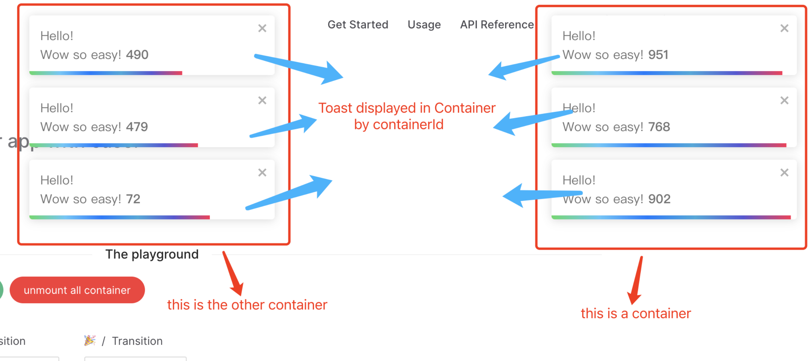

# Container Props



## Props

| Props                | Type              | Default Value            | Description     |
| -------------------- | ----------------- | ------------------------ | --------------- |
| multiple | boolean | true | display multiple at the same time |
| limit | number | - | limit the number of toast displayed at the same time |
| newestOnTop | boolean | false | Display newest toast on top |
| containerClassName | string | - | Add optional classes to the container |
| dangerouslyHTMLString | boolean | false | render unsafe string, like html tag |
| clearOnUrlChange | boolean | true | clear all toasts on url change |
| icon | IconType | - | Used to display a custom icon. Set it to `false` to prevent |
| rtl | boolean | false | Support right to left content |
| containerId | Id | toast.POSITION.TOP_RIGHT | Used to identify the Container when working with multiple container. Also used to set the id attribute |
| position | ToastPosition | toast.POSITION.TOP_RIGHT | One of top-right, top-center, top-left, bottom-right, bottom-center, bottom-left |
| autoClose | number \| boolean | 5000 | Delay in ms to close the toast. If set to false, the notification needs to be closed manually |
| closeButton | VNode \| boolean | default close icon | Replace the default close button or `false` to hide the button |
| transition | ToastTransition \| CSSTransitionProps | toast.TRANSITIONS.Bounce | A reference to a valid transition animation |
| hideProgressBar   | boolean        | false     | Display or not the progress bar below the toast(remaining time) |
| pauseOnHover      | boolean        | true      | Keep the timer running or not on hover |
| pauseOnFocusLoss  | boolean        | true      | Pause the timer when the window loses focus |
| closeOnClick      | boolean        | true      | Dismiss toast on click |
| toastClassName    | string         | -         | Add optional classes to the toast |
| bodyClassName     | string         | -         | Add optional classes to the toast body |
| style             | CSSProperties  | -         | Add optional inline style to the container |
| progressClassName | string         | -         | Add optional classes to the progress bar |
| progressStyle     | CSSProperties  | -         | Add optional inline style to the progress bar |
| role              | string         | alert     | Define the ARIA role for the toasts |
| theme             | ToastTheme     | auto | One of auto, light, dark, colored, `auto` means automatically detects system theme colors |

::: tip
By default, all toasts will inherit `container props`. Props defined on toast supersede `container props`. The demo is not exhaustive, check the doc for more!
:::

## Define the Container Props

```ts
import { createApp } from 'vue';
import Vue3Toastify, { type ToastContainerOptions } from 'vue3-toastify';
import App from './App.vue';

const app = createApp(App);

app.use(
  Vue3Toastify,
  {
    autoClose: 2000,
    style: {
      opacity: '1',
      userSelect: 'initial',
    },
  } as ToastContainerOptions,
);

app.mount('#app');
```

::: tip
You can also use `updateGlobalOptions` hook to defined the `container props`.

```ts
updateGlobalOptions({
  autoClose: 2000,
  style: {
    opacity: '1',
    userSelect: 'initial',
  },
});
```

then use it per toast

```ts
toast.success('Wow so easy!');
```
:::
