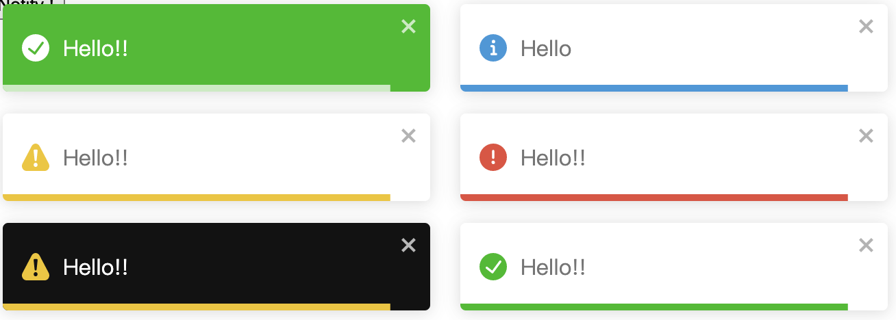

# Icons

## Built-in icons



Notifications of different types (`toast.info`, `toast.error`, `toast.success`, `toast.warning`) display an icon associated with the selected type.


::: sandbox
```vue App.vue
<script>
import { toast } from 'vue3-toastify';
import 'vue3-toastify/dist/index.css';

export default {
  name: "App",
  setup() {
    const notify = () => {
      toast.info('Hello!!'); // same as toast('Hello!!', { type: 'info' });
      toast.error('Hello!!');
      toast.success('Hello!!');
      toast.success('Hello!!', {
        theme: 'colored',
        position: toast.POSITION.TOP_LEFT,
      });
      toast.warn('Hello!!', {
        position: toast.POSITION.TOP_LEFT,
      });
      toast.warn('Hello!!', {
        theme: 'dark',
        position: toast.POSITION.TOP_LEFT,
      });
    };
    return { notify };
  }
};
</script>

<template>
  <div>
    <button @click="notify">Notify !</button>
  </div>
</template>
```
:::

## Disable icons

- Disable the icon individually

::: sandbox
```vue App.vue
<script>
import { toast } from 'vue3-toastify';
import 'vue3-toastify/dist/index.css';

export default {
  name: "App",
  setup() {
    const notify = () => {
      toast.error('Without icon', {
        icon: false,
      });
    };
    return { notify };
  }
};
</script>

<template>
  <div>
    <button @click="notify">Notify !</button>
  </div>
</template>
```
:::

- Disable the icon gloabally


::: sandbox
```vue App.vue
<template>
  <div>
    <button @click="notify">Notify !</button>
  </div>
</template>

<script>
import { toast } from 'vue3-toastify';

export default {
  name: 'App',
  setup() {
    const notify = () => toast.error('Disable the icon gloabally !');
    return { notify };
  }
};
</script>
```

```js /src/main.js [active]
import App from './App.vue';
import { createApp } from 'vue';
import Vue3Toasity from 'vue3-toastify';
import 'vue3-toastify/dist/index.css';

createApp(App).use(
  Vue3Toasity,
  {
    icon: false,
  }, // global options type definition --> ToastContainerOptions
).mount('#app');
```
:::

## Custom icons

::: sandbox
```vue App.vue
<script>
import { h } from 'vue';
import { toast } from 'vue3-toastify';
import { VNodeIcon, ComponentIcon } from './icons.jsx';
import 'vue3-toastify/dist/index.css';

export default {
  name: "App",
  setup() {
    const notify = () => {
      toast.success('You can provide any string', {
        icon: "🚀",
      });

      toast.success('You can provide any number', {
        icon: 1,
      });

      toast.success('You can provide any VNode', {
        icon: VNodeIcon,
        position: toast.POSITION.TOP_LEFT,
      });

      toast.success('You can provide a Component', {
        icon: ComponentIcon,
        position: toast.POSITION.TOP_LEFT,
      });

      // or
      toast('You can provide callback and return a component', {
        icon: ({ theme, type }) => h(ComponentIcon, { theme, type }),
        position: toast.POSITION.TOP_LEFT,
      });
    };

    return { notify };
  }
};
</script>

<template>
  <div>
    <button @click="notify">Notify !</button>
  </div>
</template>
```

```jsx /src/icons.jsx
// import { ToastType } from 'vue3-toastify'; // type ToastType, type IconProps, type ToastTheme
import { defineComponent, PropType } from 'vue';

export const ComponentIcon = defineComponent({
  props: {
    theme: {
      type: String, //  as PropType<ToastTheme>
    },
    type: {
      type: String, // PropType<ToastType>
    },
    path: {
      type: String,
      required: false,
      default: '',
    },
  },
  setup(props, { attrs }) { // props: IconProps
    return () => (
      <svg
        viewBox="0 0 1024 1024"
        version="1.1"
        xmlns="http://www.w3.org/2000/svg"
        width="32"
        height="32"
      >
        <path d="M525.64 347.76c-61.88 0-112.2-50.32-112.2-112.2s50.32-112.2 112.2-112.2 112.2 50.32 112.2 112.2-50.32 112.2-112.2 112.2z m0-176.36c-35.4 0-64.2 28.8-64.2 64.2s28.8 64.2 64.2 64.2 64.2-28.8 64.2-64.2-28.8-64.2-64.2-64.2zM809.6 627.32c-61.88 0-112.2-50.32-112.2-112.2s50.32-112.2 112.2-112.2 112.2 50.32 112.2 112.2-50.32 112.2-112.2 112.2z m0-176.4c-35.4 0-64.2 28.8-64.2 64.2s28.8 64.2 64.2 64.2 64.2-28.8 64.2-64.2-28.8-64.2-64.2-64.2zM525.64 901.16c-61.88 0-112.2-50.32-112.2-112.2s50.32-112.2 112.2-112.2 112.2 50.32 112.2 112.2-50.32 112.2-112.2 112.2z m0-176.36c-35.4 0-64.2 28.8-64.2 64.2s28.8 64.2 64.2 64.2 64.2-28.8 64.2-64.2-28.8-64.2-64.2-64.2z" fill="#99999D" p-id="1467"></path><path d="M266.92 473.36a23.98 23.98 0 0 1-15.92-41.96l170.52-150.96a23.96 23.96 0 0 1 33.88 2.08c8.8 9.92 7.84 25.08-2.08 33.88L282.8 467.32a23.9 23.9 0 0 1-15.88 6.04zM721.4 539.12H296.36c-13.24 0-24-10.76-24-24s10.76-24 24-24h425.08c13.24 0 24 10.76 24 24-0.04 13.24-10.76 24-24.04 24zM453.68 762c-5.44 0-10.96-1.84-15.44-5.64L251.48 599.2a23.98 23.98 0 0 1-2.92-33.8 23.98 23.98 0 0 1 33.8-2.92l186.76 157.16a23.98 23.98 0 0 1 2.92 33.8 23.888 23.888 0 0 1-18.36 8.56z" fill="#99999D" p-id="1468"></path><path d="M208.16 627.32c-61.88 0-112.2-50.32-112.2-112.2s50.32-112.2 112.2-112.2 112.2 50.32 112.2 112.2-50.36 112.2-112.2 112.2z m0-176.4c-35.4 0-64.2 28.8-64.2 64.2s28.8 64.2 64.2 64.2 64.2-28.8 64.2-64.2-28.8-64.2-64.2-64.2z" fill="#3A4ED0" p-id="1469"></path>
      </svg>
    );
  },
});

export const VNodeIcon = () => (
  <svg
    viewBox="0 0 1024 1024"
    version="1.1"
    xmlns="http://www.w3.org/2000/svg"
    width="32"
    height="32"
  >
    <path d="M869.32 930.4H269.96c-13.24 0-24-10.76-24-24V117.6c0-13.24 10.76-24 24-24h399.36c13.24 0 24 10.76 24 24s-10.76 24-24 24H293.96v740.8h551.32V325.92c0-13.24 10.76-24 24-24s24 10.76 24 24V906.4c0.04 13.24-10.72 24-23.96 24z" fill="#99999D" p-id="1316"></path><path d="M670.44 118.24v204.12h196.12z" fill="#99999D" p-id="1317"></path><path d="M866.56 346.36h-196.12c-13.24 0-24-10.76-24-24V118.24c0-9.8 5.96-18.6 15.04-22.28 9.08-3.64 19.48-1.44 26.28 5.64l196.12 204.12a23.92 23.92 0 0 1 4.76 26.04 24.072 24.072 0 0 1-22.08 14.6z m-172.12-48h115.76l-115.76-120.48v120.48zM757.16 478h-189.4c-13.24 0-24-10.76-24-24s10.76-24 24-24h189.4c13.24 0 24 10.76 24 24s-10.72 24-24 24zM757.16 774.56h-85.4c-13.24 0-24-10.76-24-24s10.76-24 24-24h85.4c13.24 0 24 10.76 24 24s-10.72 24-24 24zM757.16 626.28h-85.4c-13.24 0-24-10.76-24-24s10.76-24 24-24h85.4c13.24 0 24 10.76 24 24s-10.72 24-24 24z" fill="#99999D" p-id="1318"></path><path d="M149.72 362.08h286.12v286.12H149.72z" fill="#3A4ED0" p-id="1319"></path><path d="M435.84 672.2H149.72c-13.24 0-24-10.76-24-24V362.08c0-13.24 10.76-24 24-24h286.12c13.24 0 24 10.76 24 24v286.12c0 13.24-10.72 24-24 24z m-262.12-48h238.12V386.08H173.72v238.12z" fill="#3A4ED0" p-id="1320"></path><path d="M268.08 507.28l-57.52-86.68h45.72l34.4 57.8L328 420.56h45.2l-59.36 86.68 59.36 88.52H329.32l-38.64-60.16-37.84 60.16h-44.4l59.64-88.48z" fill="#FFFFFF" p-id="1321"></path><path d="M569.2 781.92H371.56c-13.24 0-24-10.76-24-24s10.76-24 24-24h197.68c13.24 0 24 10.76 24 24s-10.76 24-24.04 24z" fill="#3A4ED0" p-id="1322"></path><path d="M508.08 856.16a24 24 0 0 1-16.96-40.96l58.6-58.6-55.44-55.4c-9.36-9.36-9.36-24.56 0-33.96 9.36-9.36 24.56-9.36 33.96 0l72.4 72.4a23.948 23.948 0 0 1 0 33.92l-75.56 75.56a24.124 24.124 0 0 1-17 7.04z" fill="#3A4ED0" p-id="1323"></path>
  </svg>
);
```
:::

:::tip
Code in Jsx:

```jsx
toast('HELLO', {
  icon: ({ theme, type }) => (
    <ComponentIcon
      theme={theme}
      type={type}
      class={theme}
      style={{ fontSize: '12px' }}
    />
  ),
});
```
:::
